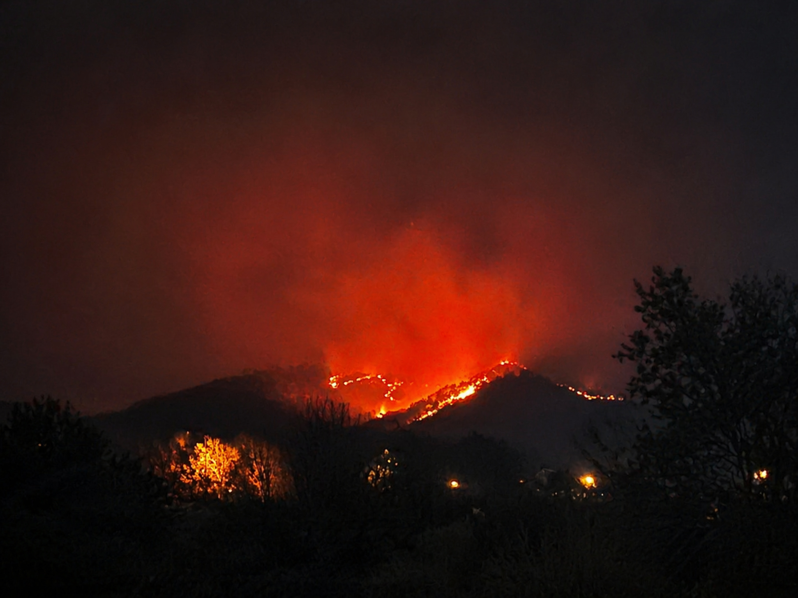
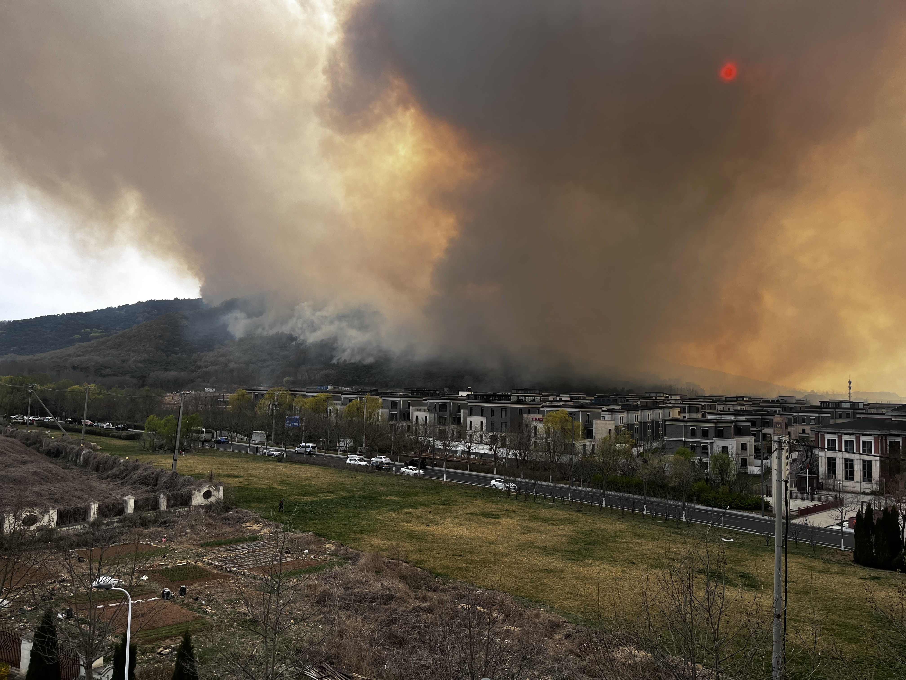
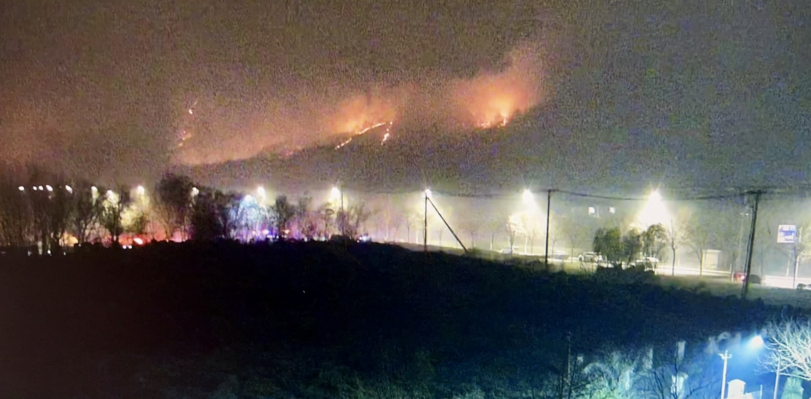
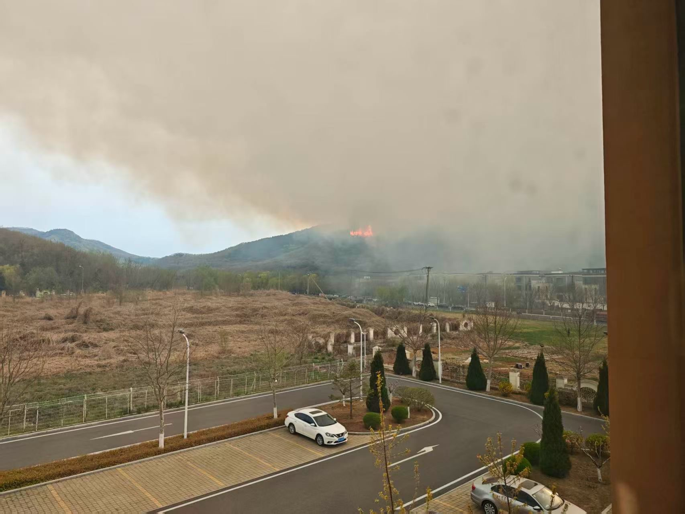
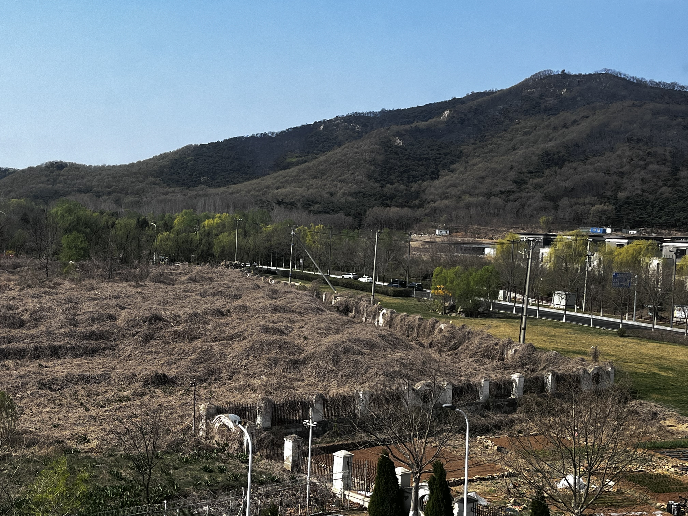

# Wildfire Incident Response Case Study  
### Real-World Incident → Systems Thinking, IT, and Cybersecurity Alignment

---

## 🚨 Critical Trigger Point (Primary Decision Moment)

  

**Figure 1:** High-intensity wildfire approaching the school perimeter under low-visibility night conditions.

This image represents the **decision threshold that defined the entire response**:

> **Trigger:** Fire crosses beyond the dry field boundary → Immediate evacuation initiated

At this point:
- Fire intensity was increasing  
- Visibility was reduced  
- Reaction time was limited  

This is equivalent to:
- A security breach crossing a network boundary  
- A system moving from warning → critical state  
- A condition where delay results in loss of control  

**Key principle:**  
Predefined triggers eliminate hesitation under pressure.

---

## Overview

This case study documents a real-world wildfire incident near a school campus and demonstrates structured incident response under uncertainty.

Although physical in nature, the response directly aligns with:
- IT Systems Administration  
- Cybersecurity (SOC / Incident Response)  
- Network monitoring and escalation protocols  

The focus is on:
- Detection and signal interpretation  
- Threshold-based decision-making  
- Controlled response execution  
- System design under pressure  

---

## Incident Context

- Environment: School campus adjacent to dry vegetation field and hillside  
- Population: 100+ students under supervision  
- Threat: Active wildfire progressing toward perimeter  
- Constraints:
  - No immediate external directive  
  - Limited night visibility  
  - Rapidly changing conditions  

---

## Threat Detection & Signal Analysis

### Early Signals

  

- Sudden wind shift  
- Smell of smoke  
- Visible smoke over terrain  

**Interpretation:**
- Smoke served as an **early warning indicator**, not the primary threat  
- Triggered further investigation and validation  

**IT Equivalent:**
- Log anomalies  
- Suspicious network activity  
- Pre-incident indicators  

---

## Threat Confirmation

  

- Visual confirmation of active fire  
- Multiple ignition points observed  
- Directional spread identified  

**Assessment:**
- Threat is real and progressing  
- Not a contained or isolated event  

**IT Equivalent:**
- Confirmed incident (not false positive)  
- Correlated alerts forming a real threat pattern  

---

## Threat Progression & Risk Modeling

  

- Fire spreading along slope  
- Terrain accelerating movement  
- Fuel continuity increasing risk  

**Assessment:**
- Fire likely to move toward perimeter  
- Dry field identified as **primary risk corridor**

**IT Equivalent:**
- Lateral movement across network  
- Attack path analysis  
- Identifying high-risk assets  

---

## Boundary Definition (Critical for Decision-Making)

  

- Clear separation between safe zone and risk zone  
- Dry vegetation field identified as trigger boundary  

**Design Decision:**
- Define a **hard, observable threshold**  
- Remove ambiguity from decision-making  

**IT Equivalent:**
- Network segmentation  
- Firewall boundaries  
- Trust zones  

---

## Incident Response Design

### 1. Predefined Trigger Model

> Fire crosses dry field boundary → Evacuate immediately  

- No waiting for confirmation  
- No reliance on delayed external alerts  
- No real-time debate  

**Impact:**
- Eliminates hesitation  
- Enables immediate execution  

---

### 2. Monitoring System

- Continuous visual tracking  
- Multiple observation points  
- Focus on direction, intensity, and proximity  

**IT Equivalent:**
- SIEM monitoring  
- IDS/IPS  
- Real-time alert correlation  

---

### 3. Response Preparation (Before Escalation)

- Transportation staged (school taxi on standby)  
- Muster point selected (cement field – no fuel, high visibility)  
- Secondary relocation area identified  
- Staff aligned on response expectations  

**IT Equivalent:**
- Incident response playbooks  
- Backup systems  
- Failover readiness  
- Role-based response planning  

---

### 4. Containment Strategy

- Controlled gathering of students  
- Avoidance of high-risk zones (fuel + buildings)  
- Focus on maintaining order and accountability  

**IT Equivalent:**
- Network isolation  
- Containment of compromised systems  
- Preventing spread  

---

## Outcome

- No evacuation triggered (threshold not crossed)  
- Full readiness maintained  
- No reactive or delayed decisions required  
- Situation remained controlled throughout  

---

## Lessons Learned (Post-Incident Analysis)

### What worked

- Predefined triggers eliminated hesitation  
- Early detection allowed structured response  
- Boundary-based decision-making simplified complexity  
- Resource staging reduced reaction time  

---

### What improves next iteration

- Add secondary trigger layers (e.g., air quality thresholds)  
- Introduce redundant transport options  
- Pre-assign smaller response units for faster execution  
- Strengthen communication redundancy  

---

## Cybersecurity & IT Relevance

This scenario directly maps to:

### SOC / Incident Response
- Detection → Analysis → Response lifecycle  
- Threshold-based escalation  
- Decision-making under uncertainty  

### Systems Administration
- Planning for failure conditions  
- Maintaining control during system stress  
- Structured response design  

### Networking
- Boundary definition  
- Segmentation thinking  
- Risk path identification  

---

## Skills Demonstrated

- Incident Response Strategy  
- Risk Assessment and Threat Modeling  
- Systems Thinking Under Pressure  
- Decision-Making with Defined Thresholds  
- Operational Coordination  
- Technical Documentation  

---

## Final Statement

This incident was not managed through reaction, but through **predefined structure and controlled decision-making**.

The ability to define thresholds, interpret signals, and execute under uncertainty is directly transferable to IT systems, cybersecurity operations, and incident response environments.
