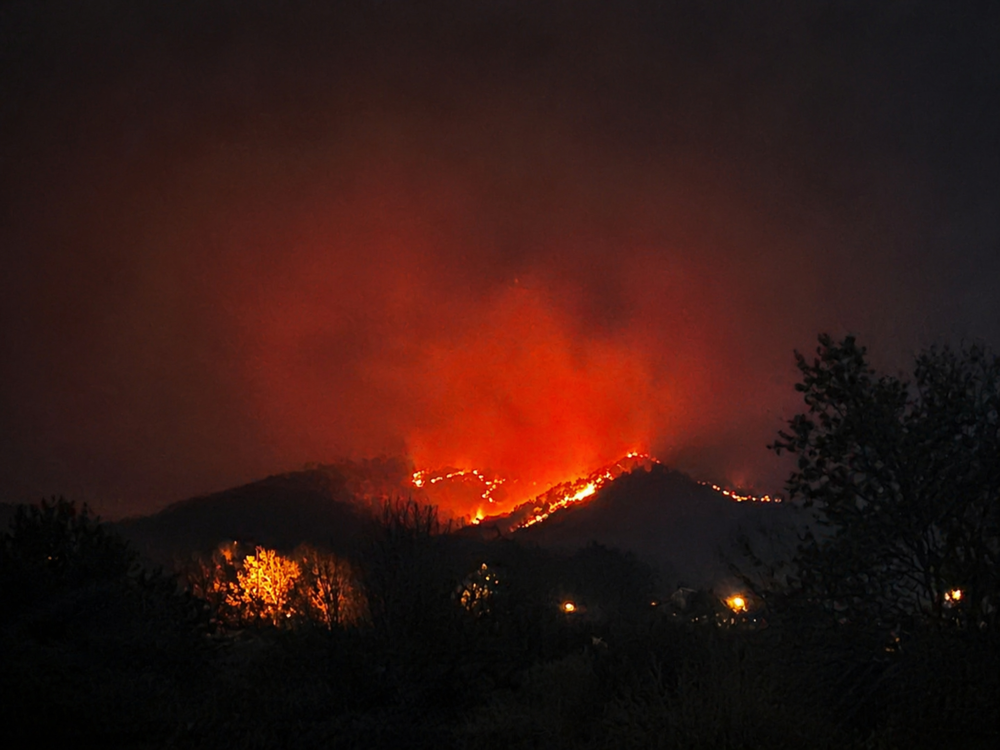
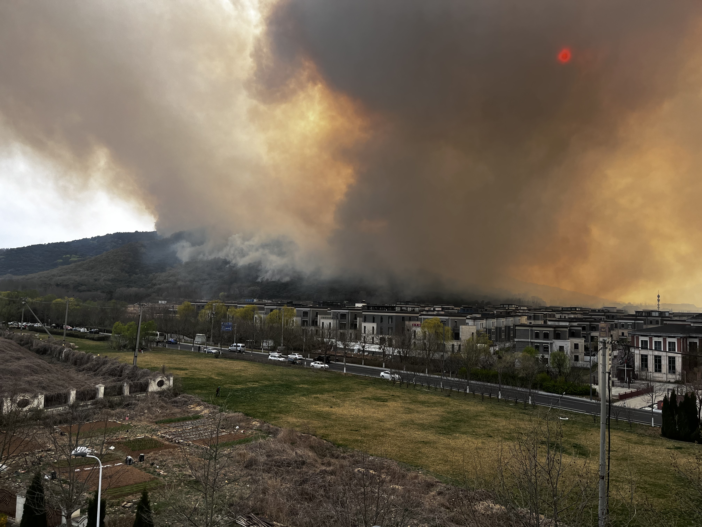
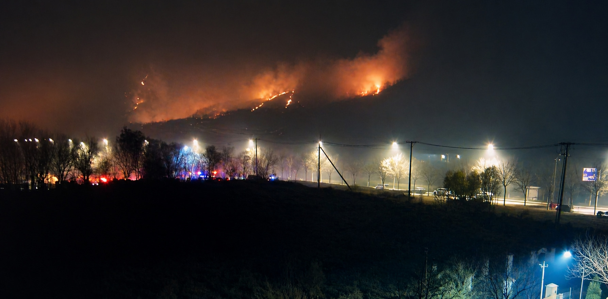
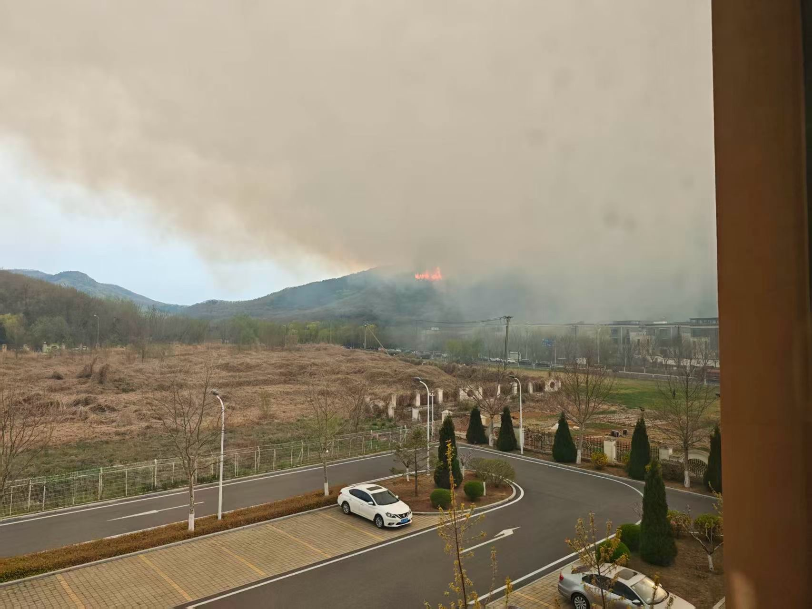
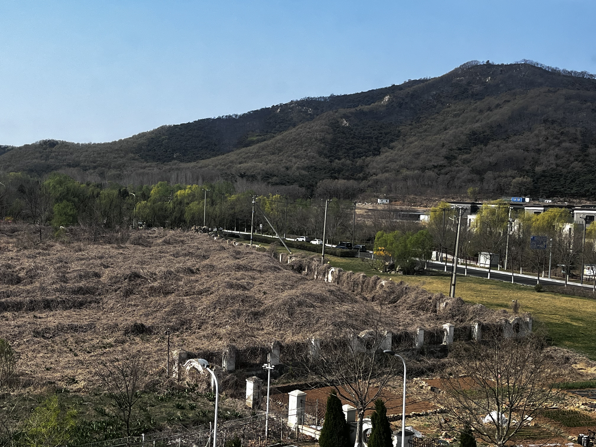

# Wildfire Incident Response Case Study  
### Incident Response, Threshold-Based Decision Making, and Operational Control Under Pressure

---

## 🚨 Critical Trigger Point (Primary Decision Moment)

  

**Trigger Condition:**  
Fire crosses the dry field boundary → Immediate evacuation

**Why it mattered:**
- Limited visibility  
- Increasing fire intensity  
- No time for debate  

**Result:**  
A predefined trigger eliminated hesitation and ensured immediate action if conditions escalated.

---

## 📌 Context

Real-world incident involving a wildfire approaching a boarding facility.

- Population: 119 students (reduced to 76 during incident)  
- Threat: Active fire moving toward perimeter  
- Constraints:
  - No immediate external directive  
  - Limited visibility  
  - Rapidly changing conditions  

This scenario required structured decision-making under uncertainty.

---

## 🔍 Threat Detection & Confirmation

### Early Signal Detection

  

**Observed:**
- Wind shift  
- Smoke presence  
- Reduced visibility  

**Decision:**  
Treat smoke as a valid early warning signal and escalate monitoring.

---

### Threat Confirmation

  

**Observed:**
- Visible fire activity  
- Multiple ignition points  
- Directional spread  

**Result:**  
Threat confirmed as active and progressing.

---

## 📈 Threat Progression & Risk Modeling

  

**Problem:**  
Fire spread influenced by terrain and fuel continuity.

**Decision:**  
Identify likely path of progression toward school boundary.

**Result:**  
Dry field defined as primary risk corridor.

---

## 🧱 Boundary Definition (Critical Control Mechanism)

  

**Problem:**  
Unclear thresholds lead to delayed or inconsistent decisions.

**Decision:**  
Define a **hard, observable boundary** for action.

**Result:**  
- Clear escalation trigger  
- No ambiguity during decision-making  

---

## ⚙️ Response Design

### 1. Predefined Trigger Model

- Fire crosses boundary → Evacuate  
- No waiting for external confirmation  
- No real-time debate  

**Outcome:**  
Decision-making removed from high-pressure moment.

---

### 2. Monitoring System

**Problem:**  
Limited visibility and changing conditions.

**Decision:**  
- Continuous visual monitoring  
- Multiple observation points  
- Redirected cameras  
- Security patrol escalation  

**Result:**  
Improved situational awareness and early detection capability.

---

### 3. Pre-Staged Response

**Problem:**  
Delayed preparation increases risk.

**Decision:**  
- Transportation staged  
- Muster point selected  
- Backup relocation identified  
- Attendance tracking prepared  
- Communication systems pre-drafted  

**Result:**  
Reduced reaction time and increased control during escalation.

---

### 4. Load Reduction Strategy

**Problem:**  
High population increases evacuation complexity.

**Decision:**  
Reduce on-site population without triggering panic.

**Result:**  
- Population reduced from 119 → 76 (~36%)  
- Faster evacuation capability  
- Lower operational complexity  

---

### 5. Containment Measures

**Problem:**  
Smoke infiltration risk.

**Decision:**  
- Seal building environment  
- Deploy air filtration  
- Control movement  

**Result:**  
Maintained safe internal conditions.

---

## 🗣️ Communication Strategy

- Repeated critical instructions verbally and digitally  
- Pre-drafted evacuation messages  
- Immediate reporting protocol for any change  
- Maintained bilingual communication capability  

**Result:**  
Reduced miscommunication and ensured consistent response execution.

---

## Outcome

- Evacuation not triggered (threshold not crossed)  
- Full readiness maintained  
- Fire activity decreased  
- No injuries or incidents  

---

## 🔍 Key Decisions That Mattered

- Defined hard escalation threshold  
- Acted on early signals instead of waiting  
- Reduced system load proactively  
- Staged resources before escalation  
- Maintained continuous monitoring  

---

## 🧠 System Understanding

- Systems fail when thresholds are unclear  
- Early signals must be validated, not ignored  
- Load reduction improves control  
- Delayed decisions increase risk  
- Structured response prevents panic-driven actions  

---

## 📌 Key Lessons

- Predefined triggers eliminate hesitation  
- Early detection enables control  
- Resource staging reduces response time  
- Clear boundaries simplify complex decisions  
- Operational control depends on preparation, not reaction  

---

## 💻 IT / Cybersecurity Relevance

### Incident Response
- Detection → Analysis → Response lifecycle  
- Threshold-based escalation  
- Continuous monitoring under changing conditions  

### Systems Administration
- Planning for failure conditions  
- Maintaining control under system stress  
- Resource staging and continuity planning  

### Networking
- Boundary definition  
- Segmentation thinking  
- Risk path identification  

---

## Summary

This incident demonstrates the ability to operate under uncertainty using structured decision-making rather than reactive judgment.

Key outcomes:

- Established clear thresholds to control escalation  
- Used early signals to guide response decisions  
- Reduced operational complexity through proactive action  
- Maintained full system control without incident  

**Result:**  
A real-world demonstration of incident response, decision-making under pressure, and maintaining control in a dynamic environment.
